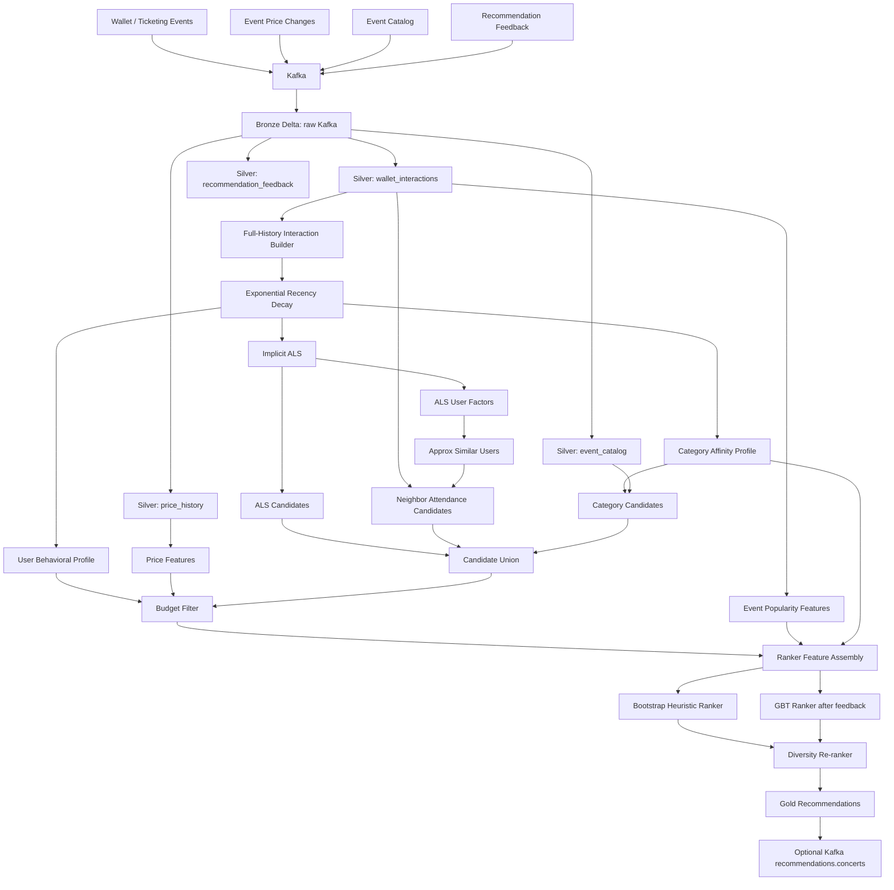
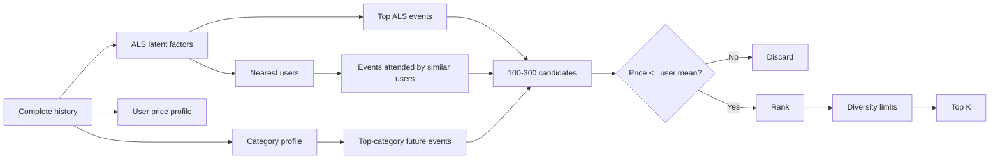

# Concert & Live-Events Recommender — Scala + Databricks + Kafka

Production-oriented reference implementation for recommending concerts and live shows from online-wallet/ticket behavior.

The system intentionally uses the **complete user history**, not only the last N events. Historical interactions are weighted with exponential time decay so old preferences remain informative without dominating current taste.

## Core recommendation rule

For every known user, candidate events are generated from three independent signals:

1. **ALS collaborative filtering** over the full weighted user-event history.
2. **Similar-user attendance** using approximate nearest neighbors over normalized ALS user factors.
3. **Category affinity** from the user's full decayed history.

Before ranking, the system enforces the hard budget constraint:

```text
current_event_price <= user's lifetime average paid ticket price
```

Price movements, popularity growth and behavioral signals then influence ranking. The model cannot override the hard budget rule.

---

## Architecture



---

## Why full history instead of only 3 events?

For user `u` and historical event `i`:

```text
interaction_strength(u,i)
  = action_weight(i)
  * exp(-ln(2) * age_days(i) / half_life_days)
```

With the default 365-day half-life:

| Age | Recency weight |
|---:|---:|
| 30 days | ~0.94 |
| 180 days | ~0.71 |
| 365 days | 0.50 |
| 730 days | 0.25 |
| 1460 days | ~0.06 |

Nothing is arbitrarily deleted. Recent behavior simply has more influence.

Default interaction strengths:

| Signal | Base weight | ALS? |
|---|---:|---|
| Ticket redeemed | 4.0 | Yes |
| Ticket purchased | 2.5 | Yes |
| Event clicked | 0.5 | Yes |
| Ticket refunded | negative signal | No |
| Ticket transferred | negative signal | No |

Refunds and transfers are kept outside ALS because implicit ALS should receive non-negative confidence signals. They can later be used by the supervised ranker.

---

## Recommendation pipeline



### Similar-user probability

Neighbors do not vote equally. Their ALS latent-space similarity is used as weight:

```text
P(event | user)
  = sum(similarity(user, neighbor) * attended(neighbor,event))
    / sum(similarity(user, neighbor))
```

`SimilarUserEngine` normalizes ALS factor vectors and uses Bucketed Random Projection LSH. For unit vectors, Euclidean distance can be converted back to cosine similarity:

```text
cosine_similarity = 1 - distance^2 / 2
```

This avoids an all-pairs exact similarity calculation.

---

## Price logic

The hard eligibility condition is:

```text
current_price <= lifetime_avg_price
```

The price engine also creates:

```text
current_price
lifetime_avg_price
recent_avg_price
median_price
p75_price
max_price
price_stddev
price_ratio
price_distance
price_change_1d
price_change_7d
price_volatility_7d
value_opportunity
demand_pressure
```

Where:

```text
price_ratio = current_price / lifetime_avg_price

price_distance =
  (lifetime_avg_price - current_price) / lifetime_avg_price
```

A falling price can become a `value_opportunity`. A rising price is not automatically negative; together with demand/popularity growth it can indicate urgency.

---

## Ranking strategy

### Phase 1 — bootstrap

Before enough recommendation impressions exist, use:

```text
33% similar-user probability
24% category affinity
19% squashed ALS score
9% price opportunity
8% popularity growth
7% recent-market match
```

This is implemented in `HeuristicRanker.scala`.

### Phase 2 — supervised GBT

Once the app emits recommendation impressions and feedback, `ConcertRanker` trains a `GBTClassifier` from real positives and negatives.

Positive labels:

```text
purchased
redeemed
```

Negative labels:

```text
shown recommendation with no purchase/redemption after the full label window
```

By default, positive examples can mature after 7 days, while a row is not treated as a true negative until the 30-day label window has closed.

This is much safer than treating an arbitrary historical event as a negative when the user may never have been exposed to it.

Ranker features currently include:

```text
als_score
neighbor_probability
category_affinity
price_ratio
price_distance
price_change_1d
price_change_7d
price_volatility_7d
value_opportunity
demand_pressure
redeemed_30d
purchases_7d
popularity_growth
historical_event_count
historical_strength
category_diversity
days_since_last_event
days_until_event
market_match
```

---

## Diversity re-ranking

A pure relevance model can return near-duplicates:

```text
1. Artist X — General Admission
2. Artist X — VIP
3. Artist X — Premium
```

The final layer caps repeated artists and categories before selecting Top K.

Default:

```text
max 1 recommendation per artist
max 2 recommendations per category
```

---

## Kafka topics

Recommended topics:

```text
wallet.ticket.purchased
wallet.ticket.redeemed
wallet.ticket.refunded
wallet.ticket.transferred

events.catalog
events.price.changed

recommendations.feedback
recommendations.concerts   # optional output
```

### Wallet interaction contract

```json
{
  "user_id": "U001",
  "event_id": "E100",
  "ticket_id": "T001",
  "event_type": "ticket_redeemed",
  "category": "Rock",
  "subcategory": "Alternative Rock",
  "artist": "Muse",
  "venue_id": "V01",
  "market": "CDMX",
  "ticket_price": 1850.0,
  "currency": "MXN",
  "event_ts": "2026-08-20T03:00:00Z"
}
```

### Price contract

```json
{
  "event_id": "E200",
  "price": 1650.0,
  "currency": "MXN",
  "observed_ts": "2026-09-15T12:00:00Z"
}
```

### Feedback contract

```json
{
  "recommendation_id": "...",
  "user_id": "U001",
  "event_id": "E200",
  "action": "purchased",
  "position": 1,
  "score": 0.87,
  "feedback_ts": "2026-09-15T14:03:00Z"
}
```

---

## Repository layout

```text
concert-recommender-scala/
├── .github/workflows/ci.yml
├── build.sbt
├── databricks.yml
├── conf/
│   └── application.conf
├── project/
│   ├── build.properties
│   └── plugins.sbt
├── scripts/
│   ├── create_tables.sql
│   └── sample_events.jsonl
└── src/
    ├── main/
    │   ├── resources/application.conf
    │   └── scala/com/acme/concertrec/
    │       ├── candidate/CandidateGenerator.scala
    │       ├── config/AppConfig.scala
    │       ├── features/
    │       │   ├── EventFeatureBuilder.scala
    │       │   ├── FeatureAssembler.scala
    │       │   ├── HistoricalInteractionBuilder.scala
    │       │   ├── PriceFeatureEngine.scala
    │       │   └── UserProfileBuilder.scala
    │       ├── jobs/
    │       │   ├── BuildRankerTrainingJob.scala
    │       │   ├── RecommendationJob.scala
    │       │   ├── SilverStreamingJob.scala
    │       │   ├── StreamingIngestionJob.scala
    │       │   ├── TrainALSJob.scala
    │       │   └── TrainRankerJob.scala
    │       ├── ml/ALSModelTrainer.scala
    │       ├── ranking/
    │       │   ├── ConcertRanker.scala
    │       │   ├── DiversityReranker.scala
    │       │   ├── HeuristicRanker.scala
    │       │   └── RankerTrainingBuilder.scala
    │       ├── similarity/SimilarUserEngine.scala
    │       ├── streaming/
    │       │   ├── KafkaIngestion.scala
    │       │   ├── RecommendationPublisher.scala
    │       │   └── SilverParsers.scala
    │       └── util/
    │           ├── Schemas.scala
    │           └── SparkSessionFactory.scala
    └── test/scala/com/acme/concertrec/
        ├── features/HistoricalInteractionBuilderSpec.scala
        ├── features/PriceFeatureEngineSpec.scala
        └── ranking/DiversityRerankerSpec.scala
```

---

## Build

The default build targets **Databricks Runtime 18 LTS**: Scala 2.13.16 and Spark 4.1.0. Spark is marked `provided`, because Databricks supplies the runtime Spark libraries.

If you must run on Databricks Runtime 16.4 LTS, switch the project to the matching Scala 2.12/2.13 variant and Spark 3.5.2 before building.

```bash
sbt clean test assembly
```

To compile against a different Spark version:

```bash
sbt -Dspark.version=<your-runtime-spark-version> clean test assembly
```

Output:

```text
target/scala-2.13/concert-recommender-scala-0.1.0.jar
```

Always align the Scala/Spark artifact versions with the Databricks Runtime selected for the job.

The repository also includes a Declarative Automation Bundle. With the Databricks CLI configured:

```bash
databricks bundle validate --var cluster_id=<cluster-id>
databricks bundle deploy --var cluster_id=<cluster-id>
```

---

## Databricks sequence

### 1. Create namespaces

Run:

```text
scripts/create_tables.sql
```

### 2. Start Bronze ingestion

Main class:

```text
com.acme.concertrec.jobs.StreamingIngestionJob
```

### 3. Start Silver parsing

```text
com.acme.concertrec.jobs.SilverStreamingJob
```

### 4. Train ALS and build profiles

```text
com.acme.concertrec.jobs.TrainALSJob
```

This creates/persists:

```text
ALS pipeline model
user_profile
user_category_profile
event_features
```

### 5. Generate recommendations

```text
com.acme.concertrec.jobs.RecommendationJob
```

Initially keep:

```hocon
ranker.mode = "heuristic"
```

To publish the final ranked list back to Kafka as well as Delta:

```hocon
output.publishToKafka = true
output.kafkaTopic = "recommendations.concerts"
```

### 6. Capture impressions

Before recommendations are shown to a user, persist the exact scoring-time features under the same `recommendation_id`. This is important: retraining later from recomputed current features creates training/serving skew.

Expected table by default:

```text
concert_rec.features.recommendation_impressions
```

### 7. Build supervised training set

```text
com.acme.concertrec.jobs.BuildRankerTrainingJob
```

### 8. Train GBT

```text
com.acme.concertrec.jobs.TrainRankerJob
```

Then switch:

```hocon
ranker.mode = "gbt"
```

---

## Offline evaluation

Use **time-based splits**, never random row splits.

Example:

```text
Train: everything before July
Validation: July-August
Test: September
```

This better simulates recommending future events.

Recommended metrics:

```text
Recall@K
Precision@K
NDCG@K
MAP@K
HitRate@K
Catalog coverage
Artist/category coverage
Novelty
Conversion rate
Redemption rate
Price-constraint violation rate
```

The last metric should always be:

```text
0.0%
```

because the budget condition is enforced before ranking.

For the supervised model, also monitor:

```text
AUC-ROC
AUC-PR
calibration
positive rate by ranking position
```

Do not rely only on classifier AUC: recommendation quality is fundamentally a ranked-list problem.

---

## Online experiment

Recommended rollout:

```text
Control  : popularity/category recommender
Variant A: ALS + category
Variant B: ALS + neighbors + category + price
Variant C: GBT ranker + diversity
```

Primary business metrics can include:

```text
recommendation CTR
purchase conversion
redeemed-ticket conversion
revenue/user
repeat attendance
hide/dismiss rate
```

Guardrails:

```text
price constraint violations
recommendation latency
category concentration
artist concentration
cold-start coverage
refund rate
```

---

## Important production considerations

### Cold start

ALS cannot infer a useful latent profile for a user with no history. A separate cold-start path should use available signals such as:

```text
explicit favorite categories/artists
market
popular events
price band
session interactions
```

The current code deliberately does not invent a historical budget for a brand-new user because the stated business rule requires recommendations not to exceed the user's historical average paid price.

### Currency

Do not average prices across currencies. Normalize to a canonical currency or partition the budget profile by currency/market before production use.

### Identity

Use a privacy-safe stable user key. Do not feed raw wallet addresses, payment credentials or unnecessary PII into model features.

### Similarity scale

The LSH implementation is appropriate as a scalable baseline. For very large user populations, consider an ANN/vector-search service over persisted user embeddings instead of recomputing global neighbor graphs during every recommendation run.

### Event lifecycle

Filter canceled, completed and off-sale events before candidate generation. Catalog status normalization should be adapted to the source ticket platform.

### Model retraining cadence

A practical starting point:

```text
Price features          streaming / near-real-time
Catalog                 streaming / near-real-time
Recommendations         every 15-60 min or event-triggered
User/event features     hourly
ALS                     daily
GBT ranker              daily or several times/week
```

Actual cadence should be decided from traffic, catalog turnover, SLA and cost.

---

## Next extensions

The architecture is deliberately modular so the next iterations can add:

```text
artist embeddings
venue affinity
geographic distance
session intent
festival co-attendance
social/group-wallet signals
inventory scarcity
sell-through velocity
contextual bandits
learning-to-rank
feature store integration
online model serving
```

A strong next modeling upgrade would be to replace the binary GBT objective with a true **learning-to-rank** model once impression volume is sufficient, while retaining ALS as candidate generation.
